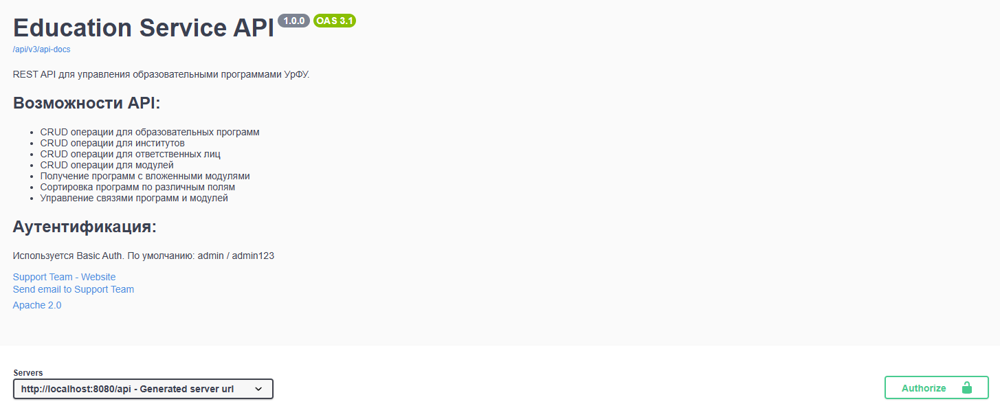
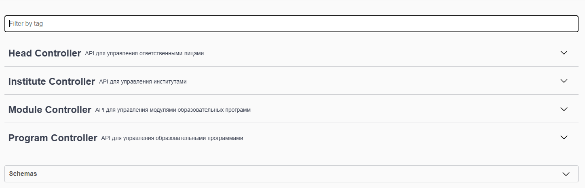
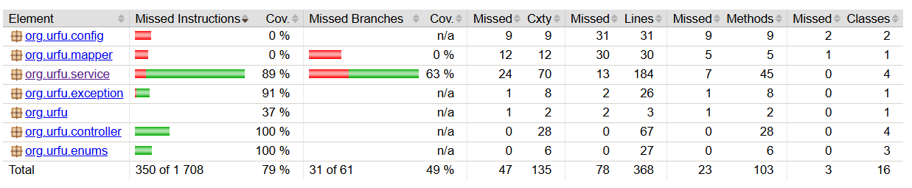

# Education Service API

[](https://github.com/Fridorovich/urfuAPI/actions/workflows/ci.yml)
[](https://adoptium.net/)
[](https://spring.io/projects/spring-boot)
[](https://www.postgresql.org/)
[](LICENSE)

## 📋 Описание

REST API сервис для управления образовательными программами УрФУ и их модулями. Сервис предоставляет полный CRUD функционал для работы с образовательными программами, институтами, ответственными лицами и модулями.

### Основные возможности:

- CRUD операции для образовательных программ
- CRUD операции для институтов
- CRUD операции для ответственных лиц
- CRUD операции для модулей
- Получение программ с вложенными модулями
- Сортировка программ по различным полям (title, cypher, accreditationDate, standard)
- Управление связями программ и модулей
- Basic Authentication
- Swagger/OpenAPI документация
- Liquibase миграции с rollback
- Docker контейнеризация
- CI/CD через GitHub Actions

## Стек

| Технология | Версия | Назначение |
|------------|--------|------------|
| Java | 21 | Язык программирования |
| Spring Boot | 3.5.3 | Фреймворк |
| Spring Data JPA | - | ORM |
| Spring Security | - | Аутентификация |
| PostgreSQL | 15 | База данных |
| Liquibase | 4.31.1 | Миграции |
| Maven | - | Сборка |
| Docker | - | Контейнеризация |
| Swagger/OpenAPI | 2.6.0 | Документация API |
| JUnit 5 | - | Тестирование |
| Mockito | - | Mock-объекты |
| JaCoCo | - | Покрытие кода |
| GitHub Actions | - | CI/CD |

## Быстрый старт

### Требования

- Java 21
- Docker & Docker Compose
- Maven 3.9+

### Создайте .env

```bash
DB_USERNAME=education_user
DB_PASSWORD=education_pass

SECURITY_USER_NAME=admin
SECURITY_USER_PASSWORD=admin123
```

### Запуск с Docker Compose

```bash
git clone https://github.com/fridorovich/urfuAPI.git
cd urfuAPI
docker-compose up -d
```
Документация доступна по ссылке `http://localhost:8080/api/swagger-ui/index.html`

## Аутентификация

Для доступа к API используется **Basic Authentication**.

---

### Учетные данные

| Параметр | Значение |
|----------|----------|
| **Username** | `admin` |
| **Password** | `admin123` |


---

## API Эндпоинты

### Образовательные программы

| Метод | Эндпоинт | Описание |
|-------|----------|----------|
| POST | `/api/programs` | Создание программы |
| GET | `/api/programs` | Получение всех программ |
| GET | `/api/programs/{uuid}` | Получение программы по ID |
| PUT | `/api/programs/{uuid}` | Обновление программы |
| DELETE | `/api/programs/{uuid}` | Удаление программы |
| GET | `/api/programs/with-modules` | Получение программ с модулями |
| GET | `/api/programs/sorted?sortBy=title` | Сортированный список программ |
| PUT | `/api/programs/{pUuid}/modules/{mUuid}` | Добавление модуля к программе |
| DELETE | `/api/programs/{pUuid}/modules/{mUuid}` | Удаление модуля из программы |

### Институты

| Метод | Эндпоинт | Описание |
|-------|----------|----------|
| POST | `/api/institutes` | Создание института |
| GET | `/api/institutes` | Получение всех институтов |
| GET | `/api/institutes/{uuid}` | Получение института по ID |
| PUT | `/api/institutes/{uuid}` | Обновление института |
| DELETE | `/api/institutes/{uuid}` | Удаление института |

### Ответственные лица

| Метод | Эндпоинт | Описание |
|-------|----------|----------|
| POST | `/api/heads` | Создание ответственного лица |
| GET | `/api/heads` | Получение всех ответственных лиц |
| GET | `/api/heads/{uuid}` | Получение ответственного лица по ID |
| PUT | `/api/heads/{uuid}` | Обновление ответственного лица |
| DELETE | `/api/heads/{uuid}` | Удаление ответственного лица |

### Модули

| Метод | Эндпоинт | Описание |
|-------|----------|----------|
| POST | `/api/modules` | Создание модуля |
| GET | `/api/modules` | Получение всех модулей |
| GET | `/api/modules/{uuid}` | Получение модуля по ID |
| PUT | `/api/modules/{uuid}` | Обновление модуля |
| DELETE | `/api/modules/{uuid}` | Удаление модуля |

---


## Примеры запросов

### Создание программы

```bash
curl -X POST http://localhost:8080/api/programs \
  -u admin:admin123 \
  -H "Content-Type: application/json" \
  -d '{
    "title": "Информационные системы",
    "cypher": "09.04.03/33.04",
    "level": "MASTER",
    "standard": "SUOS",
    "instituteUuid": "6a0099be-2bd4-409b-aee2-10984c4df380",
    "headUuid": "0e887f76-2a05-11e1-b174-00259030b74f",
    "accreditationDate": "2026-06-14",
    "moduleUuids": ["54e561d2-0a27-4644-b67a-47ab4e7881bc"]
  }'
```
## Тестирование

Проект использует **JaCoCo** для отслеживания покрытия кода.

#### Запуск с покрытием

```bash
mvn clean test jacoco:report
```
#### Просмотр отчета

Отчет о покрытии доступен в формате HTML
```bash
start target\site\jacoco\index.html
```
